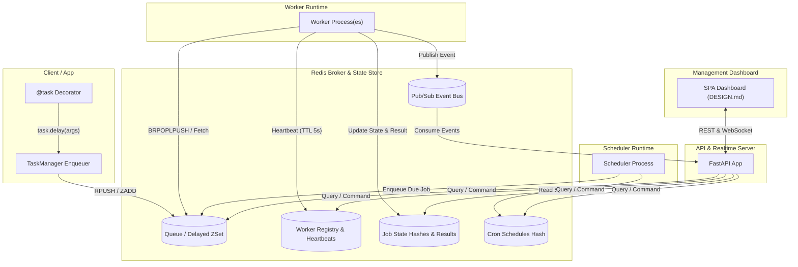

# System Architecture

## Overview
TaskManager consists of four modular layers:
1. **Core Engine & Client SDK (`taskmanager.core`)**: Defines tasks via `@task`, handles serialization, enqueuing, priority sorting, retry policies, and Redis key space conventions.
2. **Worker Runtime (`taskmanager.worker`)**: Autonomous async worker daemon that polls Redis queues, executes task coroutines/functions, sends heartbeats, handles timeouts, intercepts failures, and reaps orphaned jobs.
3. **Scheduler Engine (`taskmanager.scheduler`)**: Dynamic cron and interval runner that polls registered schedules and pushes due jobs into target queues using a Redis distributed lock.
4. **Management API & Real-Time Gateway (`taskmanager.api`)**: FastAPI application providing REST endpoints for CRUD and control actions, plus WebSocket broadcast channels for live telemetry.
5. **Dashboard SPA (`taskmanager.ui` / static dashboard)**: Interactive user interface implementing `DESIGN.md` Linear tokens for queue inspection, worker control, and cron editing.

## Redis Key Structure
- `tm:queue:<queue_name>`: List of pending job IDs.
- `tm:delayed:<queue_name>`: Sorted Set of (timestamp, job_id) for scheduled/delayed jobs.
- `tm:active:<worker_id>`: Set of job IDs currently running on worker.
- `tm:job:<job_id>`: Hash containing payload, status, retries, created_at, started_at, completed_at, error, result.
- `tm:workers`: Set of registered worker IDs.
- `tm:worker:<worker_id>`: Hash containing worker name, queues, concurrency, status, last_heartbeat, stats.
- `tm:schedules`: Hash of `schedule_id -> JSON(schedule_metadata)`.
- `tm:dlq:<queue_name>`: List of job IDs permanently failed.
- `tm:events`: Pub/Sub channel for live job and worker events.
