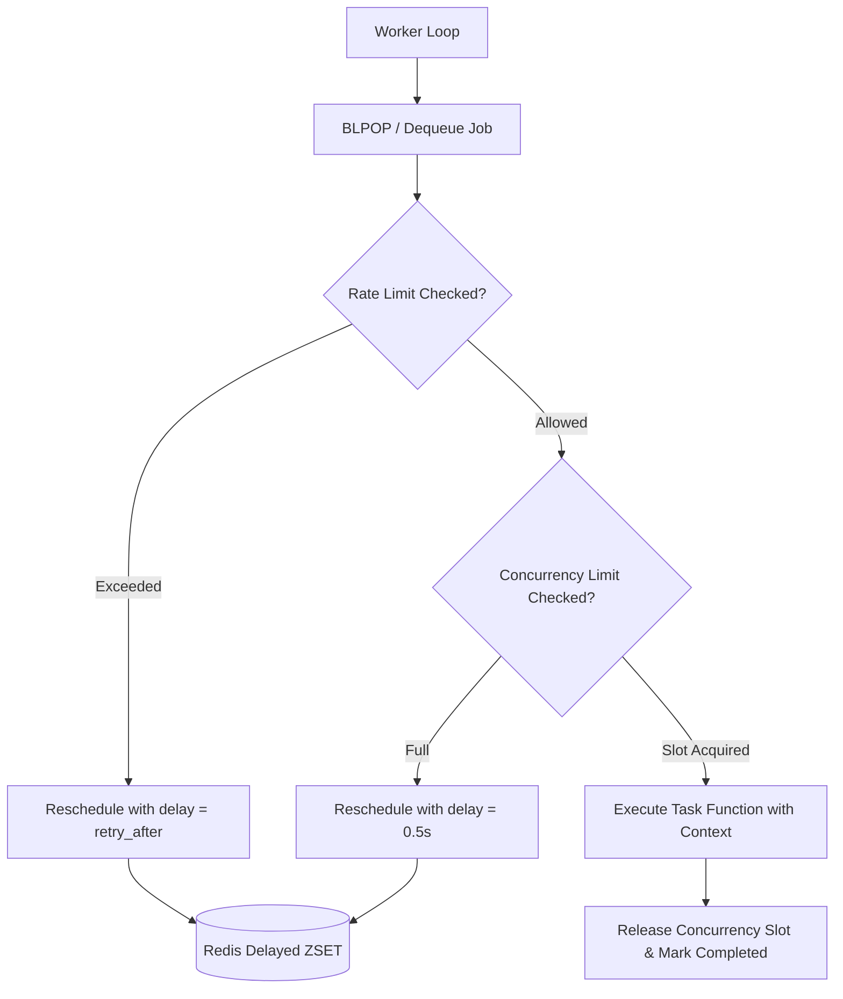

# Feature Plan: Rate Limiting & Concurrency Control per Task/Queue (ft-08)

## 1. Executive Summary & Goals
- **Objective**: Implement distributed Rate Limiting (Token Bucket algorithm in Redis) and Cluster-wide Max Concurrency control per task and queue.
- **Problem Statement**: Background tasks processing high volumes can saturate external third-party APIs (causing HTTP 429 errors or API account blocks) or exhaust database connection pools.
- **Solution**:
  1. Distributed Token Bucket rate limiter in Redis with human-friendly syntax (`"10/s"`, `"100/m"`, `"1000/h"`, `"5000/d"`).
  2. Distributed concurrency semaphore in Redis per task (`max_concurrency: int`).
  3. Worker scheduling interception: When a rate limit or concurrency limit is reached, jobs are gracefully delayed (`retry_after`) without throwing errors or counting towards failure retries.
  4. UI representation in Queues & Tasks tab with badges (`⚡ 10/s`, `🔒 Max 2`).
  5. Updated `example_tasks.py` and sample repositories with complete real-world examples.
  6. Version bump to `0.2.0` and comprehensive `README.md` update.

---

## 2. Architecture & Design Principles

### Rate Limit String Formats
- `"10/s"`, `"10/sec"`, `"10/second"` -> 10 tokens per 1.0 second.
- `"100/m"`, `"100/min"`, `"100/minute"` -> 100 tokens per 60.0 seconds.
- `"1000/h"`, `"1000/hr"`, `"1000/hour"` -> 1000 tokens per 3600.0 seconds.
- `"5000/d"`, `"5000/day"` -> 5000 tokens per 86400.0 seconds.

### Token Bucket Logic in Redis
- Key: `{prefix}:ratelimit:{task_name}`
- Fields:
  - `tokens`: Float remaining tokens.
  - `last_updated`: Timestamp of last refill.
- Calculation:
  - $elapsed = now - last\_updated$
  - $tokens = \min(capacity, tokens + elapsed \times refill\_rate)$
  - If $tokens \ge 1.0$: deduct 1.0, allowed = True.
  - Else: allowed = False, $retry\_after = (1.0 - tokens) / refill\_rate$.
