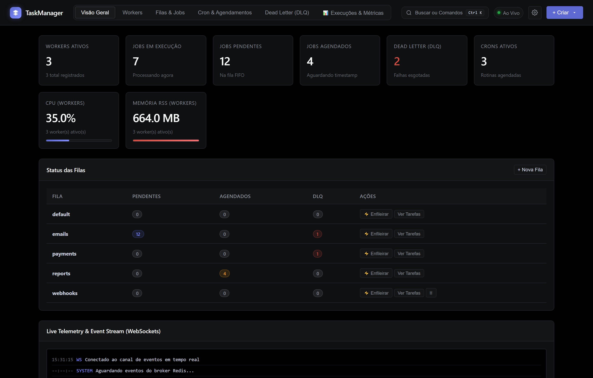
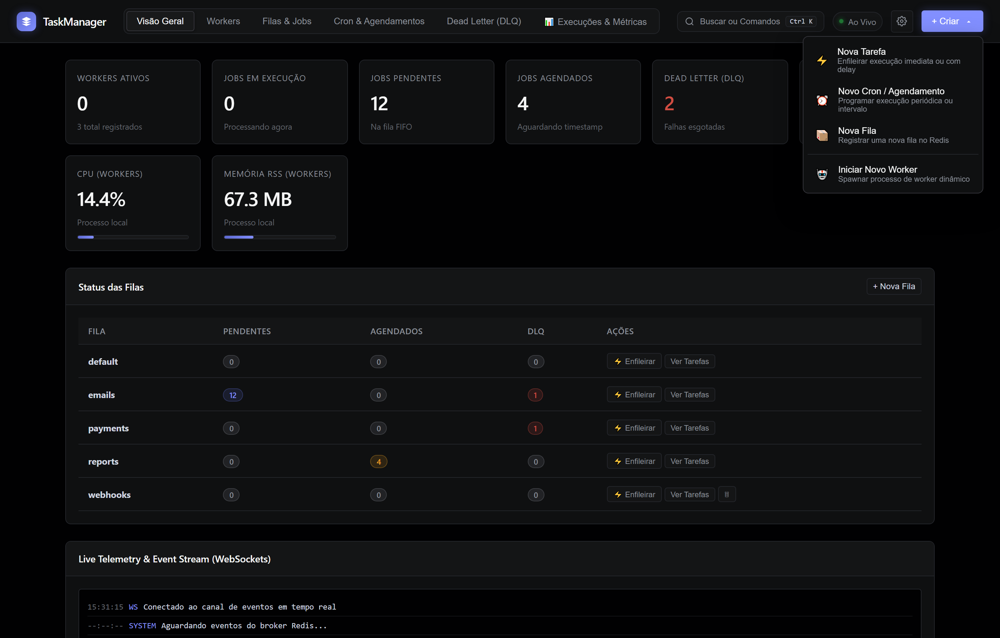
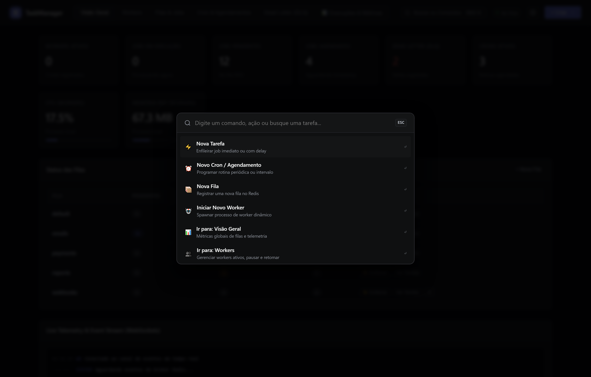
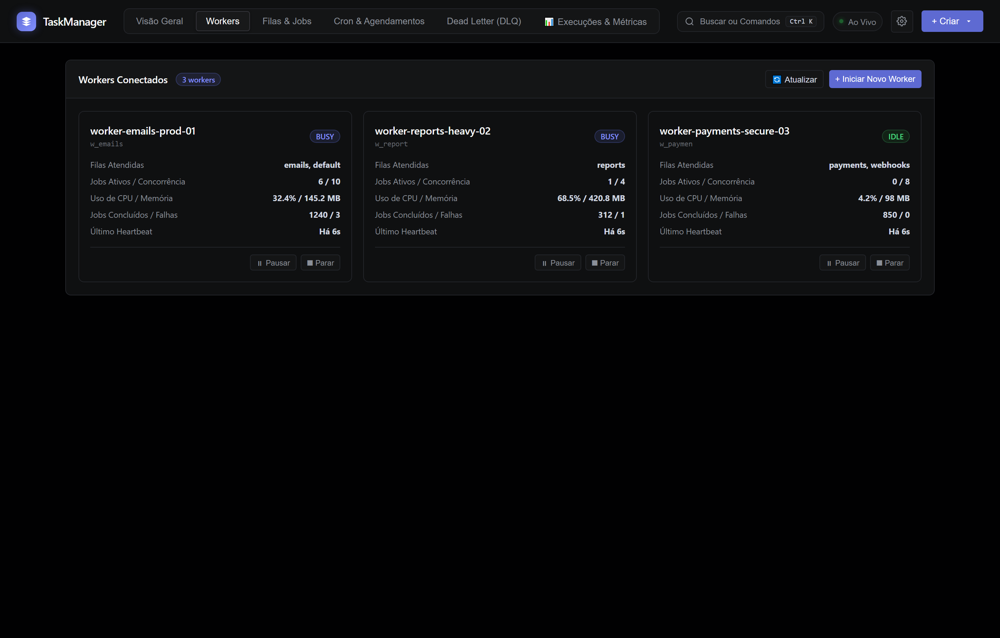
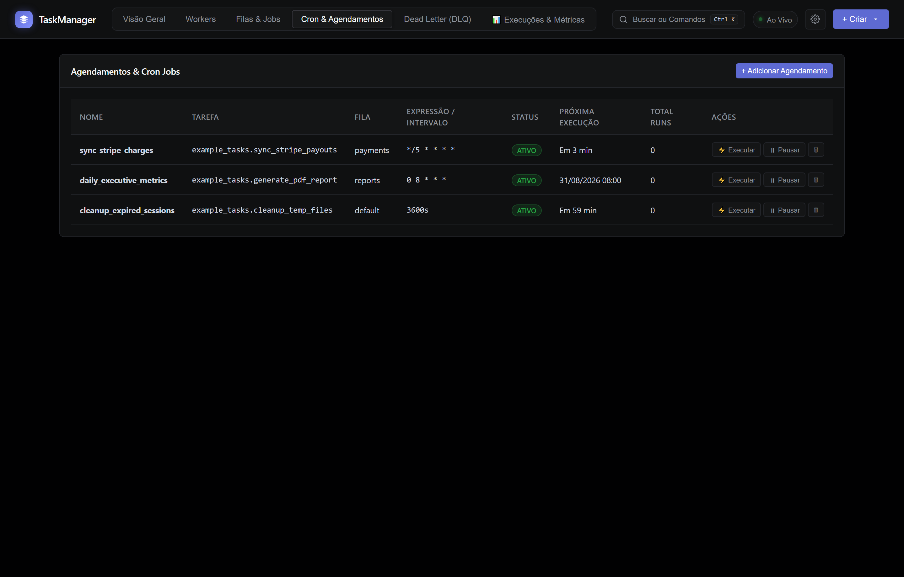
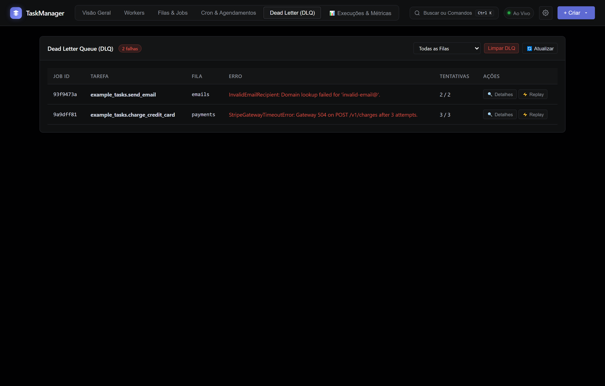
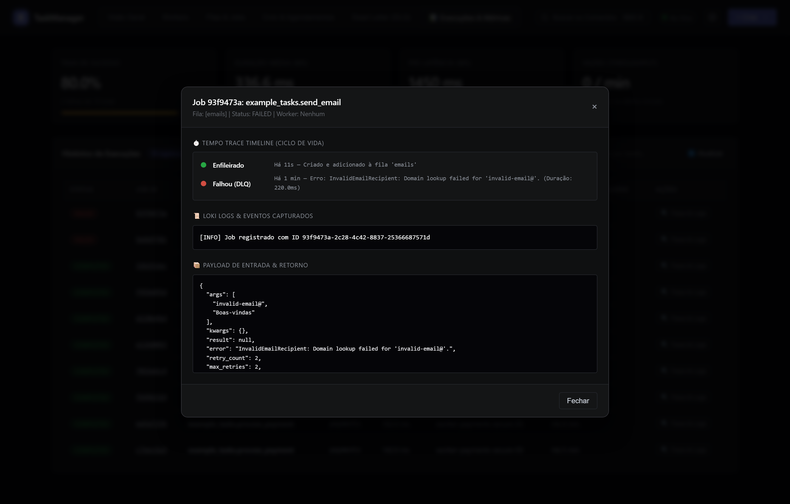

# TaskManager ⚡

<div align="center">


**Engine moderna de execução e gerenciamento de background tasks em Python inspirada no Celery e BullMQ.**  
*Agendador Cron Dinâmico • Observabilidade LGTM Completa • Dead Letter Queue Multi-Fila • Telemetria com Backpressure • Dashboard SPA Linear Dark.*

<br/>



</div>

---

## 🌟 Principais Destaques

- **🚀 Asyncio & Sync Worker Runtime**: Suporte nativo e transparente para corrotinas assíncronas (`async def`) e funções síncronas (`def`), com concorrência ajustável e timeouts granulares.
- **📦 Redis Broker com Durabilidade AOF**: Sem brokers pesados. Utiliza listas atômicas do Redis (`LPOP`/`BLPOP`), conjuntos ordenados para jobs agendados e histórico, e persistência AOF para garantia de *Zero Data Loss*.
- **🧠 Fallback In-Memory Automático**: Modo de desenvolvimento zero-dependência (`fakeredis`) quando o Redis local não estiver em execução.
- **✨ Decorator `@task` & Introspecção**: Enfileiramento via `.delay(*args, **kwargs)` ou `.apply_async(...)` com geração automática de schemas e payload no painel.
- **⏰ Agendador Cron & Intervalos em Tempo Real**: Sintaxe padrão de 5 posições (`*/5 * * * *`) ou intervalo em segundos com distributed leader locking e execução garantida.
- **🛡️ Resiliência, DLQ & Backpressure**: Retentativas com exponential backoff, Dead Letter Queue (DLQ) com inspeção de stacktrace e *One-Click Replay*. Circuit breaker de CPU e Memória RSS por worker.
- **📊 Observabilidade LGTM Nativa**:
  - **📈 Mimir / Prometheus**: KPIs em tempo real (Taxa de Sucesso %, Duração Média ms, Latência P95 ms, Throughput/min).
  - **📜 Loki**: Console de logs de execução, erros e tracebacks capturados.
  - **⏱️ Tempo**: Linha do tempo em cascata (Enqueued ➔ Dequeued ➔ Executing ➔ Finished/Failed).
- **🎨 Design System Linear Dark**: Interface minimalista com atalho global **`Ctrl+K` (Command Palette)**, menu de ação unificado **`+ Criar ▾`**, e realce suave de linhas.
- **🔌 Plug-and-Play em Qualquer Framework**: Use como aplicação independente ou embarque facilmente dentro do seu projeto **FastAPI**, **Django** ou **Flask**.

---

## 📦 Como Usar o TaskManager no seu Projeto (Biblioteca / Framework)

Você pode adicionar o TaskManager ao seu projeto Python existente de 3 maneiras:

```bash
# Instalar no seu projeto via PyPI:
pip install taskmanager-engine
# ou usando UV:
uv add taskmanager-engine

# Dica: Para forçar o download da versão mais recente ignorando o cache local do UV:
uv sync --refresh
# ou
uv add "taskmanager-engine>=0.1.2" --refresh
```

---

### Método 1: Embutir no FastAPI / Starlette (Sub-Aplicação / Mount)

Monte o dashboard e os endpoints do TaskManager diretamente dentro da sua aplicação FastAPI existente:

```python
# main.py
from fastapi import FastAPI
from taskmanager import TaskManager, task

# 1. Cria sua aplicação principal
app = FastAPI(title="Minha API Principal")

# 2. Configura a instância do TaskManager apontando para o Redis
tm = TaskManager(redis_url="redis://localhost:6379/0", prefix="meu_app")

# 3. Define tarefas usando o decorator @task
@task(name="emails.enviar_boas_vindas", queue="emails", max_retries=3)
async def enviar_boas_vindas(email: str, nome: str):
    print(f"Enviando e-mail para {nome} <{email}>...")
    return {"status": "enviado"}

# 4. Monta o dashboard do TaskManager sob a rota /tasks
tm.mount_to(app, path="/tasks")

@app.post("/cadastro")
async def cadastrar_usuario(email: str, nome: str):
    # Enfileira o job em background
    job = await enviar_boas_vindas.delay(email=email, nome=nome)
    return {"mensagem": "Usuário cadastrado!", "job_id": job.id}
```

*Ao acessar `http://localhost:8000/tasks/`, o dashboard completo estará rodando dentro da sua própria aplicação!*

---

### Método 2: Integração com Django (`taskmanager.contrib.django`)

O TaskManager possui integração de primeira classe com o ecossistema Django:

1. Adicione `'taskmanager.contrib.django'` ao seu `INSTALLED_APPS` em `settings.py`:
```python
# settings.py
INSTALLED_APPS = [
    "django.contrib.admin",
    "django.contrib.auth",
    ...,
    "taskmanager.contrib.django",  # <- Adicione aqui
    "meu_app_vendas",
]

# Configurações opcionais do Redis
TASKMANAGER_REDIS_URL = "redis://localhost:6379/0"
TASKMANAGER_REDIS_PREFIX = "django_app"
```

2. Crie um arquivo `tasks.py` dentro dos seus apps Django:
```python
# meu_app_vendas/tasks.py
from taskmanager import task

@task(name="vendas.gerar_fatura", queue="faturamento", max_retries=2)
async def gerar_fatura(pedido_id: int):
    # O taskmanager.contrib.django descobre e carrega automaticamente
    # todos os módulos tasks.py de todos os apps em INSTALLED_APPS!
    ...
```

3. Adicione as URLs no seu `urls.py`:
```python
# urls.py
from django.urls import path, include

urlpatterns = [
    path("admin/", admin.site.urls),
    path("tasks/", include("taskmanager.contrib.django.urls")),  # <- Dashboard
]
```

4. Execute workers e schedulers nativamente com `manage.py`:
```bash
# Iniciar worker consumindo as filas do Django:
python manage.py run_worker --queues faturamento,default --concurrency 5

# Iniciar o scheduler de rotinas cron:
python manage.py run_scheduler
```

---

### Método 3: Modo Standalone / CLI (Sidecar Desacoplado)

Se preferir manter o TaskManager como um serviço separado (sidecar):

```bash
# Modo Dev (Dashboard + Worker + Scheduler apontando para seus módulos de tarefas):
taskmanager dev --modules meu_projeto.tasks --port 8000

# Processos isolados para Produção:
taskmanager worker --modules meu_projeto.tasks --queues emails,default -c 8
taskmanager scheduler --modules meu_projeto.tasks
taskmanager server --port 8080
```

---

## 📂 Pasta de Exemplos Práticos (`samples/`)

O repositório inclui projetos de exemplo completos e prontos para rodar:

| Exemplo | Descrição | Como Executar |
| :--- | :--- | :--- |
| [📁 samples/fastapi_sample](samples/fastapi_sample) | API FastAPI completa montando o TaskManager em `/tasks/` com endpoints de checkout e e-mail. | `uv run python -m samples.fastapi_sample.main` |
| [📁 samples/django_sample](samples/django_sample) | Projeto Django configurado com `taskmanager.contrib.django`, `tasks.py` e comandos `manage.py`. | `python samples/django_sample/manage.py run_worker` |
| [📁 samples/standalone_cli](samples/standalone_cli) | Demonstração de uso puro via linha de comando desacoplada. | `uv run taskmanager dev --modules samples.standalone_cli.tasks` |

---

## 🛠️ Como Compilar e Publicar a Biblioteca (PyPI)

Para gerar os pacotes `.whl` (Wheel) e `.tar.gz` (Source Distribution) com todos os arquivos de UI embutidos:

```bash
# 1. Atualizar a versão no pyproject.toml e sincronizar o lockfile local
uv lock
uv sync --all-extras

# 2. Compilar os artefatos de distribuição
uv build
# (ou via python -m build)

# 3. Testar instalação local em modo editável
pip install -e .

# 4. Publicar no PyPI
uv publish --token <SEU_TOKEN_PYPI>
# (ou twine upload dist/*)

# 5. Em projetos externos, ignorar o cache do UV para baixar a nova versão imediatamente:
uv sync --refresh
# ou
uv add "taskmanager-engine>=0.1.2" --refresh
# (ou limpar todo o cache local: uv cache clean)
```

---

## 📸 Galeria de Telas do Dashboard

### 1. Visão Geral & Métricas em Tempo Real
Acompanhe o estado de todas as filas, consumo de hardware dos workers e log de eventos ao vivo via WebSockets.


---

### 2. Menu Unificado `+ Criar ▾` & Paleta de Comandos (`Ctrl+K`)
Navegue e execute qualquer ação em milissegundos sem tirar as mãos do teclado.
<div align="center">
  
  
</div>

---

### 3. Gerenciamento de Workers & Proteção de Recursos
Monitore o uso de CPU/RAM de cada worker individual e pause ou interrompa processos com um clique.


---

### 4. Agendamentos Cron & Rotinas Periódicas
Crie e edite agendamentos em tempo real sem precisar reiniciar os serviços ou fazer deploy.


---

### 5. Dead Letter Queue (DLQ) & Inspeção de Falhas
Monitore jobs que esgotaram retentativas, visualize o stacktrace completo e faça o replay imediato para a fila.


---

### 6. Observabilidade & Trace Waterfall (LGTM Stack)
Inspecione a linha do tempo exata de execução de cada tarefa com logs capturados e payloads serializados.


---

## 🐳 Stack Docker & Docker Compose

Suba o cluster completo em contêineres com um único comando:

```bash
# Iniciar todos os serviços com Redis AOF persistente
docker compose up --build -d

# Visualizar status e healthchecks
docker compose ps

# Escalar workers dinamicamente
docker compose up -d --scale worker-emails=3
```

---

## 🧪 Testes & Qualidade

```bash
# Executar suíte completa de testes
uv run pytest -v tests/

# Executar linter de código
uv run ruff check taskmanager tests samples

# Sensor de Spec Drift (SDD)
node .agents/scripts/check-spec-drift.js
```

---

## 📄 Licença
Distribuído sob a licença [MIT](LICENSE). Pronto para uso individual ou corporativo.
